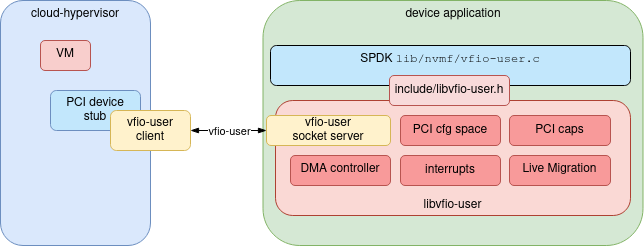

libvfio-user
============

vfio-user is a framework that allows implementing PCI devices in userspace.
Clients (such as [qemu](https://qemu.org)) talk the [vfio-user
protocol](https://lists.gnu.org/archive/html/qemu-devel/2020-11/msg02458.html)
over a UNIX socket to a server. This library, `libvfio-user`, provides an API
for implementing such servers.



[VFIO](https://www.kernel.org/doc/Documentation/vfio.txt) is a kernel facility
for providing secure access to PCI devices in userspace (including pass-through
to a VM). With `vfio-user`, instead of talking to the kernel, all interactions
are done in userspace, without requiring any kernel component; the kernel `VFIO`
implementation is not used at all for a `vfio-user` device.

Put another way, `vfio-user` is to VFIO as
[vhost-user](https://www.qemu.org/docs/master/interop/vhost-user.html) is to
`vhost`.

The `vfio-user` protocol is intentionally modelled after the VFIO `ioctl()`
interface, and shares many of its definitions.  However, there is not an exact
equivalence: for example, IOMMU groups are not represented in `vfio-user`.

There many different purposes you might put this library to, such as prototyping
novel devices, testing frameworks, implementing alternatives to qemu's device
emulation, adapting a device class to work over a network, etc.

The library abstracts most of the complexity around representing the device.
Applications using libvfio-user provide a description of the device (eg. region and
IRQ information) and as set of callbacks which are invoked by `libvfio-user` when
those regions are accessed.

Memory Mapping the Device
-------------------------

The device driver can allow parts of the virtual device to be memory mapped by
the virtual machine (e.g. the PCI BARs). The business logic needs to implement
the mmap callback and reply to the request passing the memory address whose
backing pages are then used to satisfy the original mmap call; [more details
here](./docs/memory-mapping.md).

Interrupts
----------

Interrupts are implemented via eventfd's passed from the client and registered
with the library. `libvfio-user` consumers can then trigger interrupts by
writing to the eventfd.

Building libvfio-user
=====================

Build requirements:

 * `meson` (v0.53.0 or above)
 * `apt install libjson-c-dev libcmocka-dev` or
 * `yum install json-c-devel libcmocka-devel`

The kernel headers are necessary because VFIO structs and defines are reused.

To build:

```
meson build
ninja -C build
```

Finally build your program and link with `libvfio-user.so`.

Supported features
==================

With the client support found in
[cloud-hypervisor](https://github.com/cloud-hypervisor/cloud-hypervisor/) or the
in-development [qemu](https://gitlab.com/qemu-project/qemu) support, most guest
VM use cases will work. See below for some details on how to try this out.

However, guests with an IOMMU (vIOMMU) will not currently work: the number of
DMA regions is strictly limited, and there are also issues with some server
implementations such as SPDK's virtual NVMe controller.

Currently, `libvfio-user` has explicit support for PCI devices only. In
addition, only PCI endpoints are supported (no bridges etc.).

API
===

The API is currently documented via the [libvfio-user header file](./include/libvfio-user.h),
along with some additional [documentation](docs/).

The library (and the protocol) are actively under development, and should not
yet be considered a stable API or interface.

The API is not thread safe, but individual `vfu_ctx_t` handles can be
used separately by each thread: that is, there is no global library state.

Mailing List & Chat
===================

libvfio-user development is discussed in libvfio-user-devel@nongnu.org.
Subscribe here: https://lists.gnu.org/mailman/listinfo/libvfio-user-devel.

We are on Slack at [libvfio-user.slack.com](https://libvfio-user.slack.com)
([invite link](https://join.slack.com/t/libvfio-user/shared_invite/zt-193oqc8jl-a2nKYFZESQMMlsiYHSsAMw));
or IRC at [#qemu on OFTC](https://oftc.net/).

Contributing
============

Contributions are welcome; please file an
[issue](https://github.com/nutanix/libvfio-user/issues/) or
[open a PR](https://github.com/nutanix/libvfio-user/pulls). Anything substantial
is worth discussing with us first.

Please make sure to mark any commits with `Signed-off-by` (`git commit -s`),
which signals agreement with the [Developer Certificate of Origin
v1.1](https://en.wikipedia.org/wiki/Developer_Certificate_of_Origin).

Running `make pre-push` will do the same checks as done in github CI. After
merging, a Coverity scan is also done.

See [Testing](docs/testing.md) for details on how the library is tested.

Examples
========

The [samples directory](./samples/) contains various libvfio-user examples.

lspci
-----

[lspci](./samples/lspci.c) implements an example of how to dump the PCI header
of a libvfio-user device and examine it with lspci(8):

```
# lspci -vv -F <(build/dbg/samples/lspci)
00:00.0 Non-VGA unclassified device: Device 0000:0000
        Control: I/O- Mem- BusMaster- SpecCycle- MemWINV- VGASnoop- ParErr- Stepping- SERR- FastB2B- DisINTx-
        Status: Cap+ 66MHz- UDF- FastB2B- ParErr- DEVSEL=fast >TAbort- <TAbort- <MAbort- >SERR- <PERR- INTx-
        Region 0: I/O ports at <unassigned> [disabled]
        Region 1: I/O ports at <unassigned> [disabled]
        Region 2: I/O ports at <unassigned> [disabled]
        Region 3: I/O ports at <unassigned> [disabled]
        Region 4: I/O ports at <unassigned> [disabled]
        Region 5: I/O ports at <unassigned> [disabled]
        Capabilities: [40] Power Management version 0
                Flags: PMEClk- DSI- D1- D2- AuxCurrent=0mA PME(D0-,D1-,D2-,D3hot-,D3cold-)
                Status: D0 NoSoftRst+ PME-Enable- DSel=0 DScale=0 PME-
```

The above sample implements a very simple PCI device that supports the Power
Management PCI capability. The sample can be trivially modified to change the
PCI configuration space header and add more PCI capabilities.


Client/Server Implementation
----------------------------

[Client](./samples/client.c)/[server](./samples/server.c) implements a basic
client/server model where basic tasks are performed.

The server implements a device that can be programmed to trigger interrupts
(INTx) to the client. This is done by writing the desired time in seconds since
Epoch to BAR0. The server then triggers an eventfd-based IRQ and then a message-based
one (in order to demonstrate how it's done when passing of file descriptors
isn't possible/desirable). The device also works as memory storage: BAR1 can
be freely written to/read from by the host.

Since this is a completely made up device, there's no kernel driver (yet).
[Client](./samples/client.c) implements a client that knows how to drive this
particular device (that would normally be QEMU + guest VM + kernel driver).

The client excercises all commands in the vfio-user protocol, and then proceeds
to perform live migration. The client spawns the destination server (this would
be normally done by libvirt) and then migrates the device state, before
switching entirely to the destination server. We re-use the source client
instead of spawning a destination one as this is something libvirt/QEMU would
normally do.

To spice things up, the client programs the source server to trigger an
interrupt and then migrates to the destination server; the programmed interrupt
is delivered by the destination server. Also, while the device is being live
migrated, the client spawns a thread that constantly writes to BAR1 in a tight
loop. This thread emulates the guest VM accessing the device while the main
thread (what would normally be QEMU) is driving the migration.

Start the source server as follows (pick whatever you like for
`/tmp/vfio-user.sock`):

```
rm -f /tmp/vfio-user.sock* ; build/dbg/samples/server -v /tmp/vfio-user.sock
```

And then the client:

```
build/dbg/samples/client /tmp/vfio-user.sock
```

After a couple of seconds the client will start live migration. The source
server will exit and the destination server will start, watch the client
terminal for destination server messages.

gpio
----

A [gpio](./samples/gpio-pci-idio-16.c) server implements a very simple GPIO
device that can be used with a Linux VM.

Start the `gpio` server process:

```
rm /tmp/vfio-user.sock
./build/dbg/samples/gpio-pci-idio-16 -v /tmp/vfio-user.sock &
```

Next, build `qemu` and start a VM, as described below.

Log in to your guest VM.  You'll probably need to build the `gpio-pci-idio-16`
kernel module yourself - it's part of the standard Linux kernel, but not usually
built and shipped on x86. 

Once built, you should be able to load the module and observe the emulated GPIO
device's pins:

```
insmod gpio-pci-idio-16.ko
cat /sys/class/gpio/gpiochip480/base > /sys/class/gpio/export
for ((i=0;i<12;i++)); do cat /sys/class/gpio/OUT0/value; done
```

Other usage notes
=================

qemu
----

`vfio-user` client support is not yet merged into `qemu`. Instead, download and
build [this branch of qemu](https://github.com/oracle/qemu/pull/1).

Create a Linux install image, or use a pre-made one.

Then, presuming you have a `libvfio-user` server listening on the UNIX socket
`/tmp/vfio-user.sock`, you can start your guest VM with something like this:

```
./x86_64-softmmu/qemu-system-x86_64 -mem-prealloc -m 256 \
-object memory-backend-file,id=ram-node0,prealloc=yes,mem-path=/dev/hugepages/gpio,share=yes,size=256M \
-numa node,memdev=ram-node0 \
-kernel ~/vmlinuz -initrd ~/initrd -nographic \
-append "console=ttyS0 root=/dev/sda1 single" \
-hda ~/bionic-server-cloudimg-amd64-0.raw \
-device vfio-user-pci,socket=/tmp/vfio-user.sock
```

SPDK
----

SPDK uses `libvfio-user` to implement a virtual NVMe controller: see
[docs/spdk.md](docs/spdk.md) for more details.

libvirt
-------

You can configure `vfio-user` devices in a `libvirt` domain configuration:

1. Add `xmlns:qemu='http://libvirt.org/schemas/domain/qemu/1.0'` to the `domain`
   element.

2. Enable sharing of the guest's RAM:

```xml
<memoryBacking>
  <source type='file'/>
  <access mode='shared'/>
</memoryBacking>
```

3. Pass the vfio-user device:

```xml
<qemu:commandline>
  <qemu:arg value='-device'/>
  <qemu:arg value='vfio-user-pci,socket=/var/run/vfio-user.sock,x-enable-migration=on'/>
</qemu:commandline>
```

History
=======

This project was formerly known as "muser", short for "Mediated Userspace
Device". It implemented a proof-of-concept [VFIO mediated
device](https://www.kernel.org/doc/Documentation/vfio-mediated-device.txt) in
userspace.  Normally, VFIO mdev devices require a kernel module; `muser`
implemented a small kernel module that forwarded onto userspace. The old
kernel-module-based implementation can be found in the [kmod
branch](https://github.com/nutanix/muser/tree/kmod).
